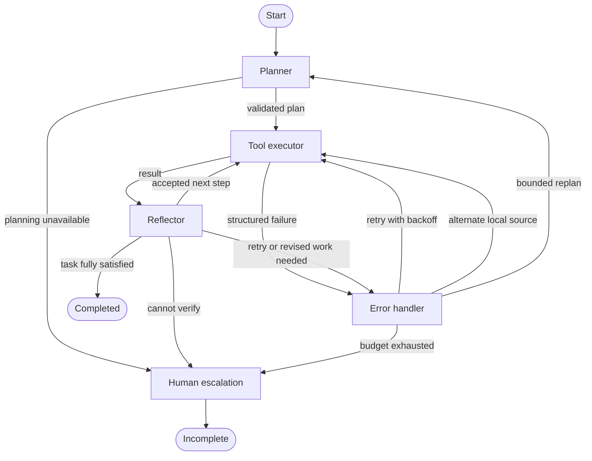

# Resilient Agent

A stateful LangGraph agent that plans tool calls, verifies evidence, retries transient failures, falls back to local retrieval, and escalates honestly when recovery is exhausted. FastAPI and a small browser UI expose the same checkpointed graph used by the CLI.

## Quick start

**CSV/Excel analysis is now included.** Existing Windows users: follow
[UPGRADE_ANALYTICS.md](UPGRADE_ANALYTICS.md). Upload a file, preview its rows,
choose a quality report, grouped totals/averages, or monthly trend, then download
CSV results or a JSON report with verification evidence. Built-in analyses work
in demo mode without API keys. See [docs/analytics.md](docs/analytics.md) for
input rules, API examples and limitations.

Requirements: Docker Engine + Compose. For local Python execution: Python 3.11+ on Linux and `libseccomp2`. The Python tool fails closed on unsupported platforms; Docker supplies Linux on macOS/Windows.

```bash
cp .env.example .env
# Edit .env: supply LLM_API_KEY and TAVILY_API_KEY; set a random API_TOKEN.
docker compose up --build
```

Open http://localhost:8080 and enter the API token. The API and its bundled UI are also at http://localhost:8000; OpenAPI is at `/docs`. The UI uses the same origin. The nginx UI service proxies to the API, avoiding CORS configuration.

For a no-key demonstration, set `LLM_MODE=demo` in `.env`, then use one of:

- `calculate: 125 * 1.08`
- `python: print(sum(i*i for i in range(10)))`
- `kb: How does exponential backoff work?`
- `search: exponential backoff retries` (without a search key, falls back immediately)

**Demo mode is a deterministic test planner, not an LLM.** General natural-language tasks require `LLM_MODE=api` and a working LLM key. The default provider adapter uses the OpenAI-compatible chat completions API with structured JSON-schema output. Swap `LLM_BASE_URL`, `LLM_MODEL`, and `LLM_API_KEY` for a compatible service. Providers without structured-output support need a different `Brain` adapter. No credentials are included.

### Local Python

```bash
python -m venv .venv
. .venv/bin/activate
pip install -r requirements.txt
# Debian/Ubuntu: sudo apt-get install libseccomp2
export DATA_DIR=./data
export LLM_MODE=demo
python -m agent.run 'calculate: 125 * 1.08'
uvicorn api.main:app --host 127.0.0.1 --port 8000 --workers 1
```

The dependency versions are pinned, including `aiosqlite==0.21.0`: the selected LangGraph SQLite saver is incompatible with the removed `Connection.is_alive()` API in aiosqlite 0.22. All environment variables used by the application are listed in `.env.example`. `MAX_ATTEMPTS` includes the first call, not just retries.

## Architecture



Every node has explicit conditional routing. `AgentState` includes the original task, validated plan, evidence records, current index, per-plan/per-step/per-tool attempt counts, structured errors, total tool calls, fallback flag, replan count, events, status, and final answer. Replanning keeps prior evidence with acceptance/rejection annotations. It replaces the remaining plan. For dependent computations, the planner can plan a prerequisite first, then replan once its result exists.

`Brain` is the only model boundary. `planner` and `reflector` request typed Pydantic outputs. Error recovery is deterministic so an LLM cannot override retry or execution budgets. `human_escalation` uses a template from actual errors and routing reasons rather than asking the model to invent a success message.

`AsyncSqliteSaver` is LangGraph's built-in SQLite checkpointer. CLI and API share its file format. Sync durability commits graph checkpoints before the next step. Node-entry and decision events are written to `DATA_DIR/transitions.jsonl` with thread IDs and timestamps. The trace records observable decisions and concise rationales, not private chain-of-thought. Task text/results live in checkpoints; treat that directory as sensitive application data.

## Tools

| Tool | Implementation | Failure behavior |
|---|---|---|
| Web search | Tavily Search REST API; source URLs and bounded snippets | Missing key, timeout, 429, HTTP failures and malformed response become structured errors |
| Calculator | Numeric AST interpreter; operators +, -, *, /, %, **; bounded input, exponents and numeric magnitude | Rejects calls, names, complex numbers, oversized values and divide-by-zero |
| Python | Separate interpreter; Linux seccomp syscall allowlist, CPU/memory/output limits | No filesystem opens or network syscalls; timeout kills and reaps child; fails closed if seccomp cannot load |
| Knowledge base | 12 bundled agent-engineering documents; persisted TF-IDF vectors in local SQLite; cosine similarity | Empty query is invalid; below-threshold search returns empty evidence for reflector rejection |
| Dataset profile | Uploaded CSV/XLSX row counts, column types, blanks and exact duplicates | Invalid formats, dimensions and formulas are rejected |
| Dataset aggregate | Decimal sums, means and counts by an explicitly selected column | Rejects nonnumeric measures; reconciles group totals and source row counts |
| Dataset trend | Monthly totals and change versus the previous observed month | Requires ISO dates; zero baselines produce null change |

The KB uses **lexical TF-IDF embeddings**, not a downloaded neural model. That makes startup small and offline, but synonym matching is limited. Documents, vocabulary, and vectors are versioned by a content fingerprint; document changes rebuild the local index. No external vector service is required.

The Python tool supports short standard Python computations that print results. Imports needing files fail after seccomp activation. It has no filesystem or network capabilities, no secrets in its environment, and no inherited application descriptors. This is stronger than removing Python builtins. For hostile public multi-tenant workloads, use a separate gVisor/Firecracker execution service: the current child still shares the host kernel and service UID. Python's `exec` is used only inside this kernel-restricted child; the calculator never uses `eval` or `exec`.

## Failure recovery

1. All calls go through a timeout/error envelope; bounded local arithmetic and retrieval cannot grow with external data. Async network calls are cancellable, and Python is killed/reaped on cancellation.
2. Retryable errors use `min(BACKOFF_CAP, BACKOFF_BASE * 2 ** (attempt - 2))` before attempts 2 onward. Invalid inputs and missing keys skip pointless retries.
3. After failed web search retries, switch that step to the local KB. The reflector must still check whether that source can answer the **original** question. A local match is not proof of a current fact.
4. Other failures or rejected evidence trigger bounded replanning. The model sees error history and previously returned evidence. Per-tool attempt counts reset only for a new plan; `MAX_REPLANS` and `MAX_TOOL_CALLS` cap the entire run.
5. Exhaustion or unavailable verification reaches terminal escalation. A result is never marked completed just because the HTTP request succeeded.

Limitations: model reflection is not a formal truth guarantee; retrieved text can be incorrect or adversarial. Prompts distinguish evidence from instructions, but production needs adversarial evaluations and stronger source policies. Read-only tools are safe to repeat; a crash between a tool call and checkpoint commit may replay the call and consume API quota. This is **at-least-once**, not exactly-once execution. No external write tools are provided.

Planner/reflector API failures currently escalate immediately instead of performing additional model retries. Replanning has a small budget. Fallback is intentionally limited to web → local KB; it cannot replace fresh web evidence. This project favors a clear recoverable path over a large tool catalog.

## Pause and resume

CLI:

```bash
LLM_MODE=demo DATA_DIR=./data python -m agent.run 'calculate: 9*9' --id example --pause
LLM_MODE=demo DATA_DIR=./data python -m agent.run --id example --resume
```

API (replace `TOKEN`):

```bash
curl -X POST http://localhost:8000/tasks \
  -H 'Authorization: Bearer TOKEN' -H 'Content-Type: application/json' \
  -d '{"task":"calculate: 9*9","pause_after_plan":true}'
# Copy the returned id:
curl http://localhost:8000/tasks/ID -H 'Authorization: Bearer TOKEN'
curl -X POST http://localhost:8000/tasks/ID/resume -H 'Authorization: Bearer TOKEN'
```

`POST /tasks` checkpoints initial state before returning 202. The UI polls every 500 ms to show the plan, node decisions, answer, and task ID. Save an ID to reconnect after a restart. Paused or crash-interrupted tasks report `interrupted` when no local worker owns them. Resume consumes the existing checkpoint with `None`, not a new task state. Already running or terminal tasks return 409 on resume. Graceful shutdown cancels workers; unfinished checkpoints remain available.

The service uses one process, four concurrent task slots, and a bounded pending queue. **Run only one API worker/replica per data directory; do not concurrently drive the same thread from CLI and API.** A production scheduler needs durable leases and a database-backed queue. A total process or disk failure cannot be recovered from an ephemeral disk.

## Verification

```bash
ruff check .
pytest -q
python -m scripts.verify
```

`docs/verification.txt` contains actual CLI and failure/crash outputs, and `docs/tests.txt` contains the actual pytest output from this build. Verification ran on Linux with Python 3.12. The Docker image and CI use Python 3.11. CI lints, tests, validates Compose and builds Docker on each push/PR.

The verification script runs a real calculator, mocks a retryable web failure, then uses real local retrieval. It next starts a separate process, waits until a deliberately blocked tool has begun after the planner checkpoint, sends SIGKILL, starts a fresh process, and resumes that exact thread. It asserts the resumed answer and confirms the planner was not rerun. The test suite covers tools, denial of sandbox I/O, timeouts, HTTP error classes, retry/fallback, terminal escalation, rejected-result replanning, multiple steps, real provider-client schema parsing against mocked HTTP, and API restart/resume.

**Verification boundary:** no live LLM or Tavily credentials were available during the build. Those HTTP integrations were tested with mocked responses. Docker was unavailable in the build environment, so the image/Compose runtime was not executed here. Run CI and a credentialed smoke test before publishing the portfolio deployment.

## Deploy on Render

Render can build this repository's Dockerfile. The API serves the UI itself, so a second nginx service is unnecessary there.

1. Push the extracted repository to GitHub (see below).
2. In Render choose **New → Web Service**, connect the GitHub repository, and select **Docker** as the runtime. Dockerfile path: `./Dockerfile`.
3. Choose the **Free** instance for a disposable demonstration. Set health-check path `/health`.
4. Add environment variables from `.env.example`; set `DATA_DIR=/app/data`, your `LLM_API_KEY`, `TAVILY_API_KEY`, `LLM_MODE=api`, and a strong `API_TOKEN`. Keep `LANGSMITH_TRACING=false` unless explicitly enabling traces.
5. Deploy. Open the assigned `https://...onrender.com` address and enter the API token in the UI. Check a calculation, a KB task, then a web task with current sources.
6. For checkpoints that survive redeploys/restarts, upgrade the service to a disk-capable paid instance, attach a persistent disk at `/app/data`, and redeploy. Keep one instance.

**Free-tier limitation:** Render free services have ephemeral local files and cannot attach persistent disks. Free hosting is suitable for the demonstration, not durable checkpoint recovery across instance replacement. Docker Compose's named volume provides local durability; do not run `docker compose down -v` unless intentionally deleting all task data. Alternatively, production can use LangGraph's Postgres saver with a managed durable database; that migration is not implemented here.

Official references checked for this build:

- https://docs.langchain.com/oss/python/langgraph/persistence
- https://docs.langchain.com/oss/python/langgraph/interrupts
- https://docs.tavily.com/documentation/api-reference/endpoint/search
- https://render.com/docs/free
- https://render.com/docs/disks

## GitHub publication

The ZIP contains a clean repository tree; no remote was created and no secrets are bundled.

```bash
git init -b main
git add .
git commit -m "Build checkpointed agent with tested failure recovery"
# With the GitHub CLI installed and authenticated:
gh repo create resilient-agent --public --source=. --remote=origin --push
```

Review before choosing public visibility. GitHub Actions runs automatically after push.

## Production next steps

- Postgres checkpoints, durable job queue and per-thread leases across replicas.
- Per-user authentication/authorization, quotas, token rotation and retention/deletion policies.
- Separate microVM sandbox with audited syscall policy and resource metering.
- Neural embeddings, source freshness validation, reranking and retrieval/answer evaluation datasets.
- Provider contract tests with real credentials, dependency locks across supported Python versions, image scanning and deployment smoke gates.
- Metrics for tool success, recoveries, escalation, latency and spend; optional LangSmith tracing via explicit environment opt-in.

The current scope is a single-service portfolio application with a real recovery loop, not a multi-tenant autonomous execution platform.
